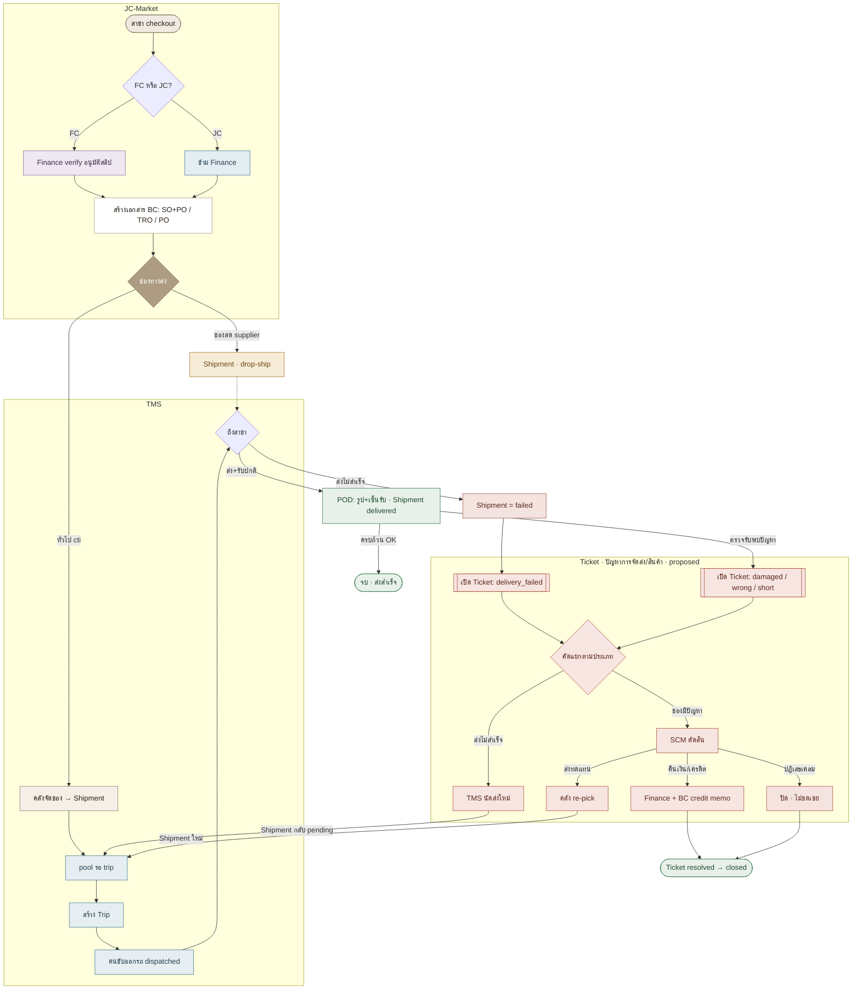

# Flow รวม: JC-Market → TMS → Ticket (ปัญหาการจัดส่ง/สินค้า)

เอกสารนี้รวมเส้นทางการทำงานตั้งแต่สาขาสั่งของ ผ่านการจัดส่งของ TMS ไปจนถึงการจัดการปัญหา
ด้วย **Ticket** ที่วน loop กลับมาส่งใหม่ หรือปิดจบด้วยการคืนเงิน/เครดิต

> **สถานะของเอกสาร**
> - **JC-Market → TMS** = ระบบที่มีอยู่จริง ตรวจแล้วว่ารันได้ (บูต `server.js` + ยิง `/api/tms/*` ผ่าน)
> - **🎫 Ticket** = flow ที่ออกแบบ **เสนอ (proposed)** ยังไม่มี implementation
>   ตอนนี้โค้ดมีแค่สถานะ shipment `failed` (ป้าย "ส่งไม่สำเร็จ" ใน `driver.html`) ที่
>   **นิยามไว้แต่ยังไม่มี endpoint ให้กด** — flow นี้ทำให้มันถูกใช้งานจริงและต่อวงจรจนจบ

หน้าเว็บเวอร์ชันมีสี/แผนภาพเต็ม: ดู artifact ที่แชร์ในแชต

---

## 1. เส้นทางรวม 3 ระบบ



> ส่วน JC-Market + TMS แบบละเอียด (5 lane, state machine ของ order/shipment/trip)
> ดูที่เอกสาร flow เดิม — เอกสารนี้ย่อสันหลักไว้เพื่อโฟกัสส่วน Ticket

---

## 2. Ticket เกิดที่ไหนได้บ้าง

จุดกำเนิด Ticket ทั้งหมดอยู่ปลายทาง TMS — ตอนคนขับส่ง หรือตอนสาขาตรวจรับ

| จุดเกิด | ใครเปิด | ประเภท | ผลกับ Shipment |
|---|---|---|---|
| คนขับถึงสาขาแต่ส่งไม่ได้ (สาขาปิด / ปฏิเสธรับ / หาที่อยู่ไม่เจอ) | คนขับ (driver app) | `delivery_failed` | ไม่เกิด `delivered` · ตั้ง **`failed`** |
| รับของแล้วพบเสียหาย / แตก / เน่า | สาขา | `damaged` | คง `delivered` · แนบ ticket |
| ได้ของผิดรุ่น / ผิดรายการ | สาขา | `wrong_item` | คง `delivered` · แนบ ticket |
| จำนวนไม่ครบ / ขาด | สาขา | `short` | คง `delivered` · แนบ ticket |
| อื่น ๆ (บิลผิด, สอบถาม) | สาขา / SCM | `other` | ไม่แตะ shipment |

---

## 3. ใครรับผิดชอบ + ทางแก้

คัดแยกตามประเภท → มอบหมายเจ้าของ → เลือกวิธีแก้ ซึ่งจะวน loop กลับ TMS หรือปิดจบ

| ประเภท | เจ้าของ | ทางแก้ | ปลายทาง |
|---|---|---|---|
| `delivery_failed` | TMS manager | นัดส่งใหม่ / เปลี่ยนรอบรถ | ↺ กลับ pool → trip ใหม่ |
| `damaged` / `wrong_item` | SCM (`admin_scm`) | ส่งทดแทน (คลัง re-pick) | ↺ Shipment ใหม่ → TMS |
| `short` | SCM | ส่งเพิ่มส่วนที่ขาด / ลดยอดบิล | ↺ หรือ Finance credit |
| `damaged`/`short` (ไม่ส่งซ้ำ) | Finance | คืนเงิน / ใบลดหนี้ (BC credit memo) | ✓ closed |
| เคลมไม่ผ่าน | SCM | ปฏิเสธพร้อมเหตุผล | ✓ closed (rejected) |

---

## 4. วงจร Ticket + โครงข้อมูลที่เสนอ

### สถานะ Ticket

```
open → assigned → in_progress → resolved → closed
                      └─(rejected)────────────┘
```

- ถ้าวิธีแก้คือ "ส่งใหม่/ทดแทน" → ticket ค้าง `in_progress` จนกว่า shipment รอบใหม่จะ `delivered` แล้วค่อย auto-resolve
- `rejected` จาก `assigned`/`in_progress` ก็ปิด (`closed`) ได้

### ตาราง `tickets` (เสนอ)

```
tickets
  id, ticket_number          -- TCK2026...
  order_id, shipment_id       -- FK → orders / shipments
  branch_code
  type          -- delivery_failed | damaged | wrong_item | short | other
  severity      -- low | normal | high
  status        -- open | assigned | in_progress | resolved | closed
  opened_by, opened_role
  assigned_to
  resolution    -- redeliver | replace | refund | credit | reject
  resolution_note
  new_shipment_id             -- ← loop กลับ TMS
  bc_credit_memo_no           -- ← Finance
  created_at, resolved_at

ticket_events   -- audit log ต่อ ticket
ticket_photos   -- รูปหลักฐานปัญหา
```

### API ที่เสนอ

| Method | Path | ใคร | หน้าที่ |
|---|---|---|---|
| POST | `/api/tms/tickets` | สาขา / คนขับ | เปิด ticket |
| GET | `/api/tms/tickets` | HQ (กรอง type/status/branch) | รายการ |
| PATCH | `/api/tms/tickets/:id` | `requireTmsManager` / `admin_scm` | มอบหมาย + เปลี่ยนสถานะ |
| POST | `/api/tms/tickets/:id/resolve` | เจ้าของ ticket | บันทึกวิธีแก้ (loop / refund / reject) |
| POST | `/api/tms/driver/shipments/:id/fail` | คนขับ | กด "ส่งไม่สำเร็จ" → `failed` + เปิด ticket อัตโนมัติ |

---

## 5. ต่อกับของเดิมยังไง

- **ปลุกสถานะ `failed` ที่ค้างอยู่** — เพิ่ม `POST /api/tms/driver/shipments/:id/fail` คู่กับ POD เดิม
  ให้คนขับกด "ส่งไม่สำเร็จ" → ตั้ง shipment `failed` + เปิด ticket อัตโนมัติ (ป้าย `pill-failed` ใน `driver.html` มีอยู่แล้ว)
- **Trip completion ไม่พัง** — โค้ดปัจจุบันปิด trip เมื่อทุก stop อยู่ใน `delivered/failed/cancelled` อยู่แล้ว
  (`server.js` ~บรรทัด 4240) ดังนั้น stop ที่ `failed` ไม่บล็อกการปิด trip — ตรงกับ flow นี้พอดี
- **Loop ส่งใหม่ = ใช้กลไกเดิม** — "นัดส่งใหม่/ทดแทน" สร้าง shipment รอบใหม่ผ่าน `createShipmentForOrder`
  (idempotent) สถานะ `pending` → เข้า pool → วาง trip ตามปกติ ไม่ต้องมี logic ขนส่งใหม่
- **Refund/credit ผูก BC** — ปลายทางคืนเงินออกใบลดหนี้ (credit memo) ใน BC คล้าย pattern `postOrderToBC`
  ที่มีอยู่ · เก็บเลขไว้ที่ `tickets.bc_credit_memo_no`
- **RBAC เดิมใช้ต่อได้** — เปิด ticket: สาขา/คนขับ · จัดการ: `requireTmsManager` (delivery) + `admin_scm` (goods) · คืนเงิน: `finance`
- **แท็บใหม่ใน `tms-admin.html`** — เพิ่ม "Tickets" ต่อจาก 5 แท็บเดิม
  (จัดของ · ประวัติ · carriers · trips · deliveries) ใช้โครง badge/modal ชุดเดียวกัน

---

_อ้างอิงจากโค้ดจริง: `server.js` (`routeOrderFulfilment`, `createShipmentForOrder`, `/api/tms/*`),
`public/tms-admin.html`, `public/driver.html` และ `CLAUDE.md`_
