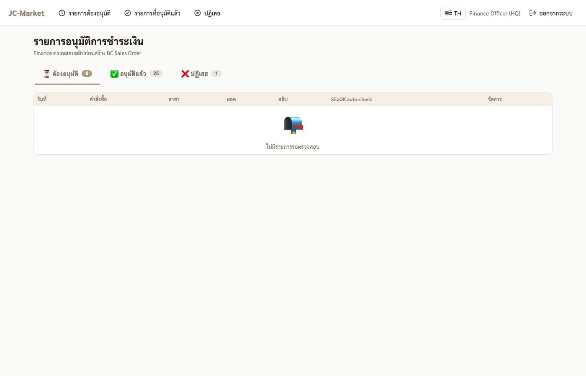
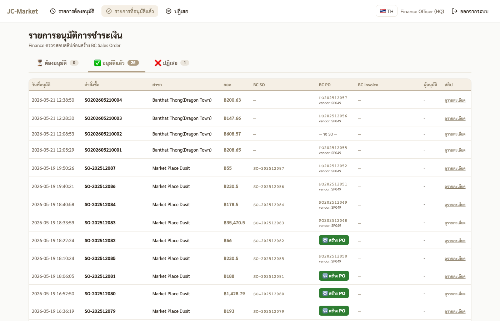
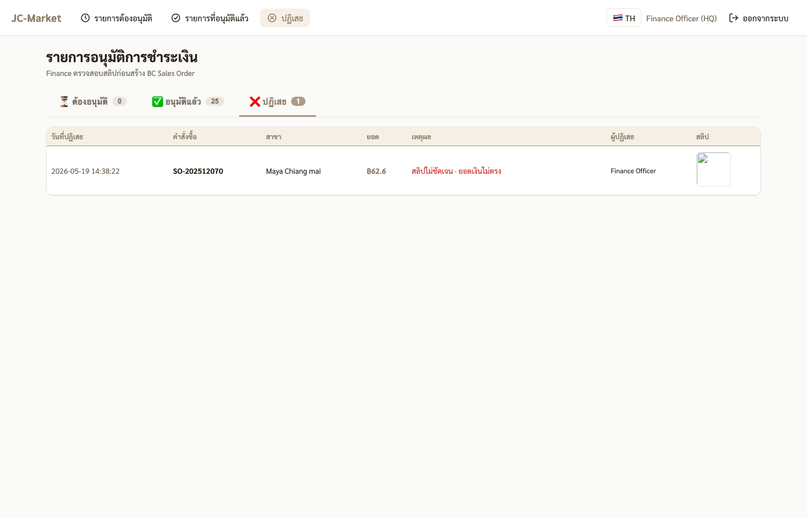

# 💰 คู่มือสำหรับ Finance

ตรวจสลิปการชำระเงินจาก FC ก่อนสร้างเอกสารใน BC

---

## 1. Login

- URL: `http://<server>:3863`
- Username: `finance`
- Password: รหัสที่ IT/Admin ส่งให้ (8 ตัว, รูปแบบ `AA######`)

หลัง login ระบบจะเด้งตรงไปหน้า **รายการอนุมัติ** อัตโนมัติ

## 2. แท็บ "ต้องอนุมัติ"

แสดงสลิปที่ FC ส่งมารอตรวจสอบ · มี info ต่อแถว:
- **วันที่** ออร์เดอร์
- **คำสั่งซื้อ** (มี badge "🔁 อัปโหลดใหม่ #N" ถ้าเป็น resubmission)
- **สาขา**
- **ยอด** เงินที่ FC สั่ง
- **สลิป** thumbnail (คลิกเพื่อขยาย)
- **SlipOK auto-check** — ผลการตรวจอัตโนมัติ (✅/⚠️)
- **จัดการ** ปุ่มอนุมัติ/ปฏิเสธ

### การอนุมัติ

กด **✅ อนุมัติ** บนแถวที่ต้องการ → ระบบจะ:
- เปลี่ยนสถานะออร์เดอร์เป็น "verified"
- สร้าง BC Sales Order (SO) + Purchase Order (PO) อัตโนมัติ (สำหรับผลไม้สดสร้างไว้ตั้งแต่ตอน checkout)
- ออก receipt number ให้ FC

### การปฏิเสธ

กด **❌ ปฏิเสธ** → modal เปิดให้กรอก**เหตุผล** (บังคับ, max 500 ตัวอักษร)
- เช่น: "สลิปไม่ชัดเจน", "ยอดเงินไม่ตรง", "ผู้รับโอนไม่ถูกต้อง"
- กด **ยืนยันปฏิเสธ** → ออร์เดอร์เป็น "failed"
- FC จะเห็นเหตุผลในหน้าคำสั่งซื้อ + อัปสลิปใหม่ได้

## 3. แท็บ "อนุมัติแล้ว"

ดูออร์เดอร์ที่อนุมัติแล้วทั้งหมด + เลข BC SO / PO / Invoice
- คอลัมน์ **BC PO** มีปุ่ม **🔁 สร้าง PO** ถ้า BC sync ค้าง — กดเพื่อ retry
- ดูเลขที่ใช้ในออร์เดอร์อ้างอิงกับ BC ได้

## 4. แท็บ "ปฏิเสธ"

ออร์เดอร์ที่โดน Finance ปฏิเสธ — แสดงเหตุผลและผู้ปฏิเสธ
- ออร์เดอร์ที่ FC re-upload สลิปแล้ว จะหายไปจากแท็บนี้ (กลับเข้า "ต้องอนุมัติ")

## 5. ข้อควรรู้

- **JC orders ไม่เห็นใน Finance** — สาขา Master ไม่ผ่าน Finance flow
- **เครดิต 7 วัน** — FC ผลไม้ที่เลือกเครดิต ยังต้องอัปสลิปและ Finance ตรวจตามปกติ (แค่ deadline ขยายเป็น 7 วัน)
- **BC ค้าง** — ถ้า BC API ล่ม ตอน approve, ออร์เดอร์ยัง verified แต่ BC SO ไม่ขึ้น · มาดูใน admin dashboard "BC Sync ค้าง" + กด Retry
- หน้าจอ refresh อัตโนมัติทุก 30 วินาที
