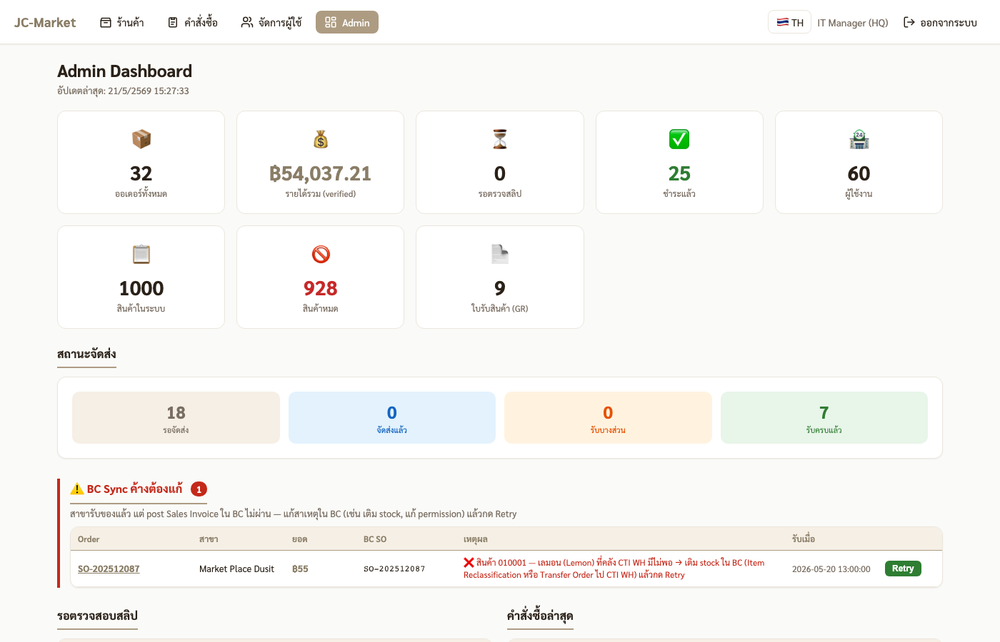
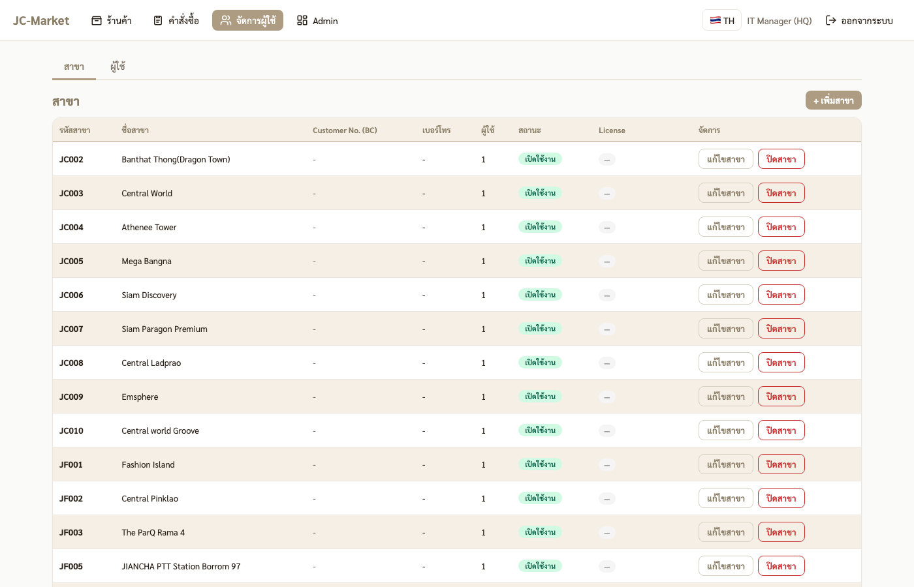
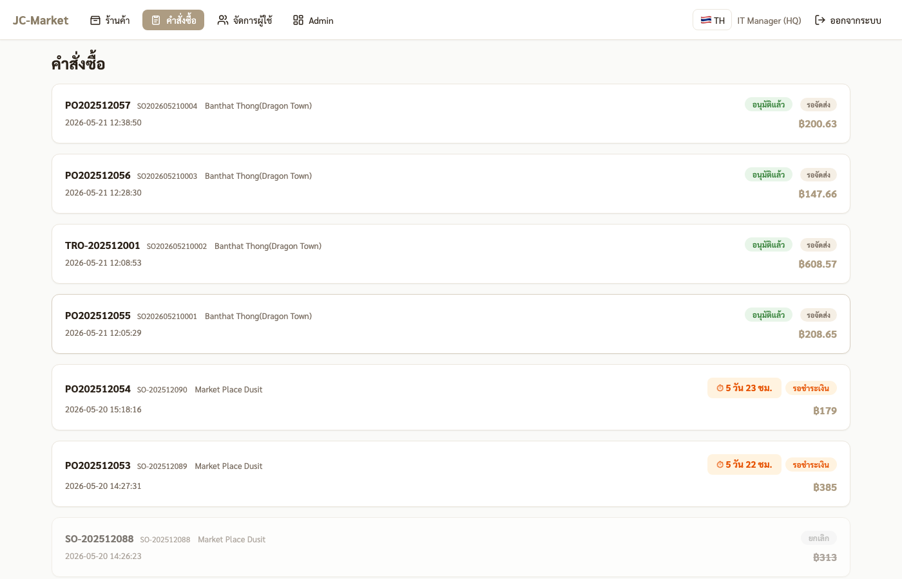

# 🛠 คู่มือสำหรับ IT / Admin

ดูแลภาพรวมระบบ + แก้ BC sync ค้าง + จัดการผู้ใช้

---

## 1. Login

- URL: `http://<server>:3863`
- Username: `itmanager` (super_admin) หรือ `admin` (admin_scm)
- Password: รหัสที่กำหนดไว้ (8 ตัว, รูปแบบ `AA######`)

## 2. Admin Dashboard

หน้าสรุปภาพรวม:
- **Summary cards** — ออเดอร์ทั้งหมด, รายได้รวม (verified), รอตรวจสลิป, ชำระแล้ว, ผู้ใช้งาน, สินค้าในระบบ, สินค้าหมด, ใบรับสินค้า
- **สถานะจัดส่ง** — รอจัดส่ง / จัดส่งแล้ว / รับบางส่วน / รับครบแล้ว
- **⚠️ BC Sync ค้าง** (ถ้ามี) — แถวสีแดงด้านบน · สาขารับของแล้ว แต่ post Sales Invoice ใน BC ไม่ผ่าน
- **รอตรวจสอบสลิป** + **คำสั่งซื้อล่าสุด** — list ตารางด้านล่าง
- **กราฟยอด 7 วันล่าสุด** + **สินค้าขายดี Top 10**

### แก้ BC Sync ค้าง

ปุ่ม **Retry** บนแถวที่ค้าง → ระบบเรียก BC API อีกครั้ง
- ก่อน retry: ดู error column → แก้ root cause ใน BC ก่อน (เช่น เติม stock, แก้ permission, item posting setup)
- หลังแก้แล้วกด Retry — สำเร็จ → แถวหายไป

## 3. จัดการผู้ใช้

- ดูรายชื่อผู้ใช้ทั้งหมด · เพิ่ม/ลบ/แก้ไข role + branch
- **License key per branch** (สำหรับ control activation)
- Reset password ผู้ใช้

## 4. ดูคำสั่งซื้อทุกสาขา

- เปิดเมนู **คำสั่งซื้อ** → admin มองเห็นออร์เดอร์ของทุกสาขา (FC + JC)
- คลิกออร์เดอร์ → ดู detail · เช็ก BC SO/PO/TRO numbers, slip, การรับของ

## 5. Scripts สำหรับ admin ops

| Script | ทำอะไร |
|---|---|
| `scripts/import-bc-master.js` | sync vendor/item master จาก BC ผ่าน Excel |
| `scripts/sync-foodstory-users.js` | sync รายชื่อสาขาจาก FoodStory backend → สร้าง user/รหัส |
| `scripts/capture-training-screenshots.js` | gen screenshots สำหรับเอกสารฝึก |

ดูคำอธิบาย + flags ในไฟล์ script แต่ละตัว

## 6. ดูแล credential security

- รหัส JF/JC อยู่ใน `imports/foodstory-users-*.csv` (gitignored — ไม่ commit)
- รหัส HQ (admin/finance/itmanager) อยู่ใน `imports/hq-users-*.csv`
- ส่งให้ผู้ใช้ผ่านช่องทางปลอดภัย (ไม่อีเมล plain, ใช้ Line OA/Signal)
- รหัสตั้งใหม่: `node scripts/sync-foodstory-users.js --reset`

## 7. กรณีฉุกเฉิน

- **JC-Market server ล่ม** → restart `npm run dev` ใน `/Users/jiancha/AgenAi_Jiancha/JC-Market/`
- **BC OAuth token หมดอายุ** → restart server (token cached re-fetch)
- **FoodStory cookie หมดอายุ** → ไปที่ project FoodStory รัน `foodstory_login.js` หรือรอ cron-rotate.sh

## 8. ติดต่อ

- Bug / feature request → GitHub issues
- Server down → IT Manager ตรงสาย
