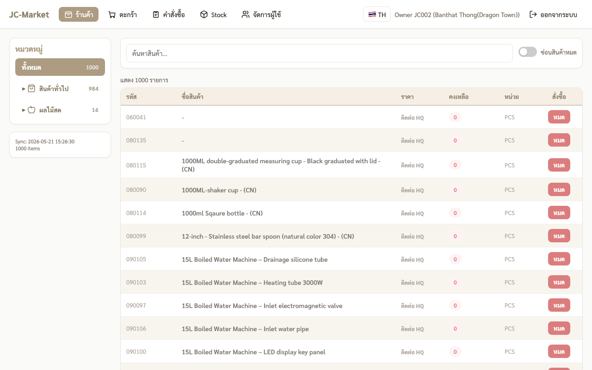
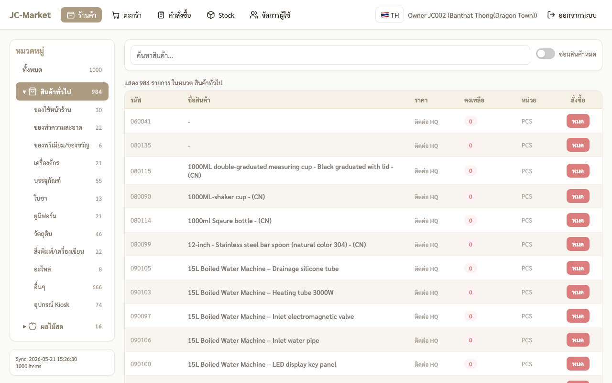
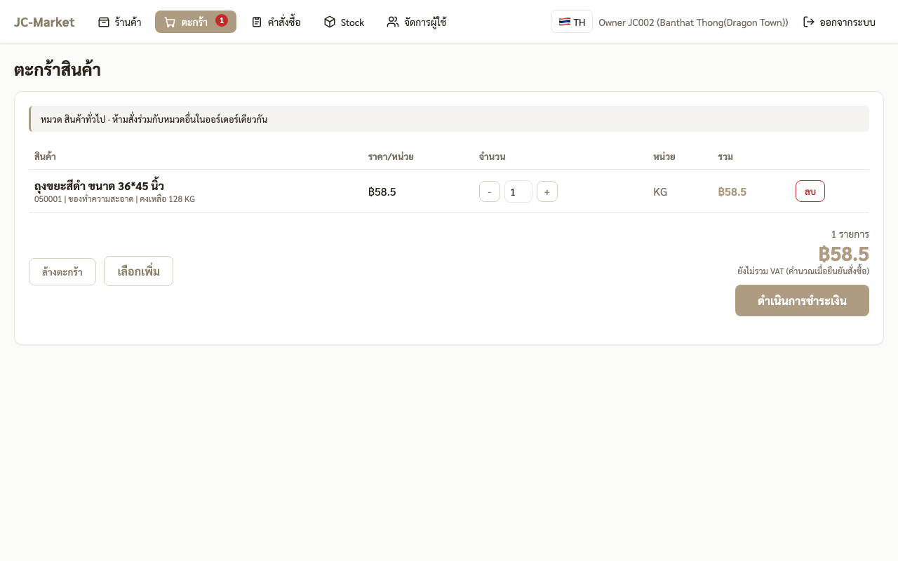
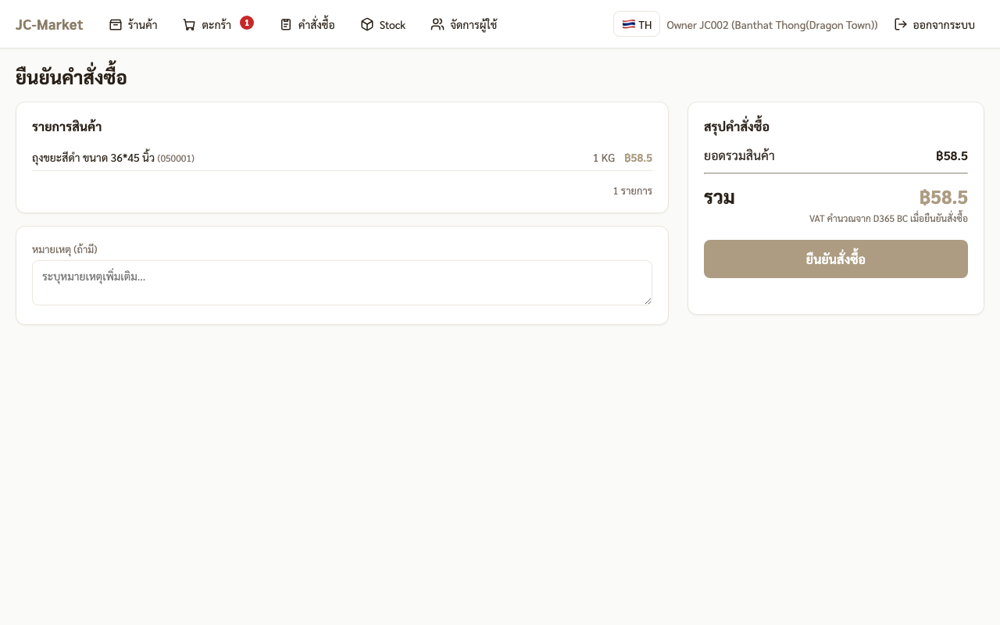
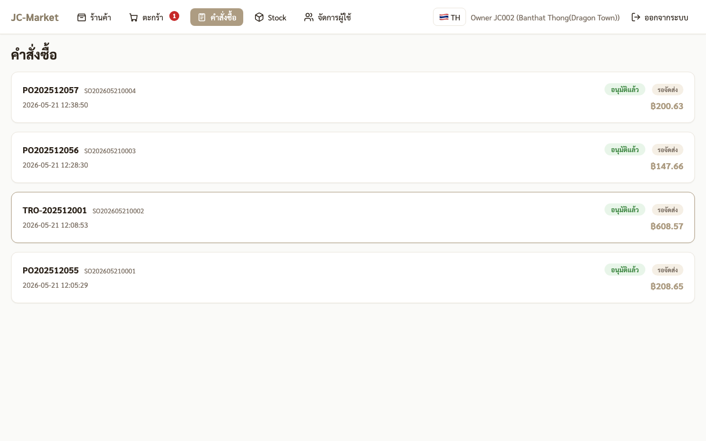

# 🏢 คู่มือสำหรับ JC (สาขา Master / Company-owned)

สาขาบริษัทเอง — ไม่ต้องชำระเงิน · BC สร้างเอกสารทันทีตอนสั่ง

---

## 1. Login

- URL: `http://<server>:3863`
- Username: รหัสสาขาตัวพิมพ์เล็ก เช่น `jc002`
- Password: รหัสที่ HQ ส่งให้ (8 ตัว, รูปแบบ `AA######`)

## 2. หน้าร้านค้า

หน้าตาเหมือน FC — sidebar 2 หมวดเดิม

> **กฎเดียวกัน**: ห้ามสั่ง "สินค้าทั่วไป" + "ผลไม้สด" รวมตะกร้าเดียวกัน

## 3. เลือกหมวด + ใส่ตะกร้า

คลิก **+ สั่ง** เพื่อใส่ตะกร้า

## 4. ตรวจตะกร้า

กด **ดำเนินการชำระเงิน**

## 5. ยืนยันคำสั่งซื้อ (ไม่มีการชำระเงิน)

**สำคัญ — JC ไม่มี radio "วิธีชำระเงิน"** (ไม่ต้องจ่าย) · มูลค่าออร์เดอร์โชว์เพื่อ tracking เท่านั้น

กด **ยืนยันสั่งซื้อ** → ระบบจะ:
- **กรณีสินค้าทั่วไป** → สร้าง **BC Transfer Order (TRO)** จาก CTI → สาขา JC
- **กรณีผลไม้สด** → สร้าง **BC Purchase Order (PO)** ตรงไปยัง vendor

ไม่ต้องผ่าน Finance, ไม่ต้องอัปสลิป — กลายเป็น "อนุมัติแล้ว" ทันที

## 6. ดูคำสั่งซื้อ + รับของ

- แถวจะแสดงเลข **TRO-xxx** (transfer) หรือ **PO-xxx** (purchase) ตรงหัว
- คลิกออร์เดอร์ → ดู detail · กดยืนยันรับของเมื่อสินค้ามาถึงสาขา

## 7. ความต่างจาก FC

| | FC (JF) | JC |
|---|---|---|
| ชำระเงิน | ต้องโอน + ส่งสลิป | ไม่ต้อง |
| Finance ตรวจ | ใช่ | ไม่ |
| BC SO + PO | สร้างหลัง Finance อนุมัติ | สร้างทันทีที่ checkout |
| BC TRO | — | สร้างทันทีสำหรับสินค้าทั่วไป |
| เครดิต 7 วัน | มี (ผลไม้สด) | — |

## 8. เคล็ดลับ

- ตอน BC ฝั่ง warehouse ส่งของ + รับ → manage ใน BC โดยตรง (จะสร้าง Posted Transfer Shipment + Posted Transfer Receipt)
- ระบบจะ track ความเคลื่อนไหวสต๊อกอัตโนมัติเมื่อใน BC โพสต์ TRO/PO เรียบร้อย
