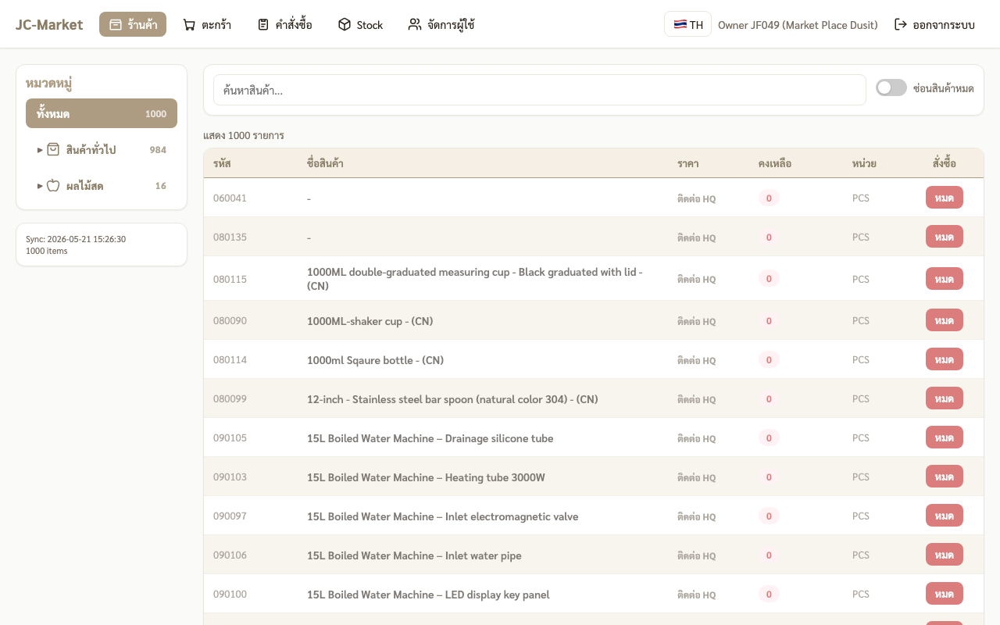
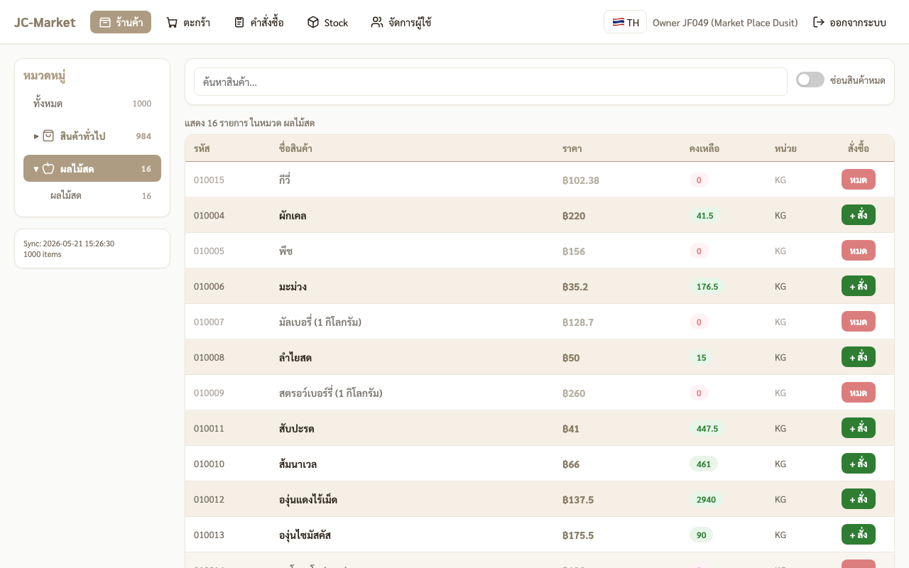
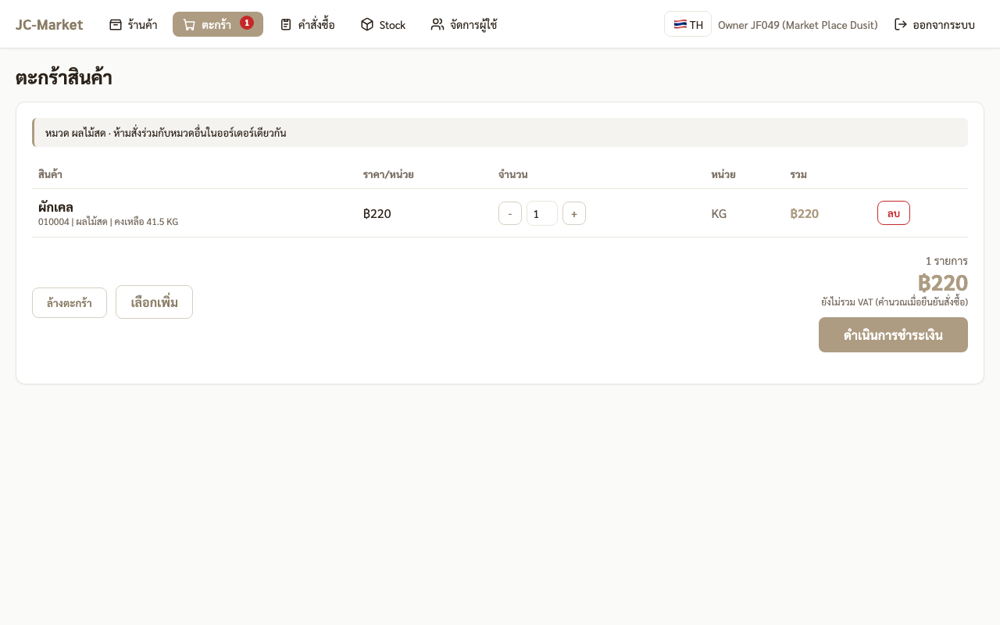
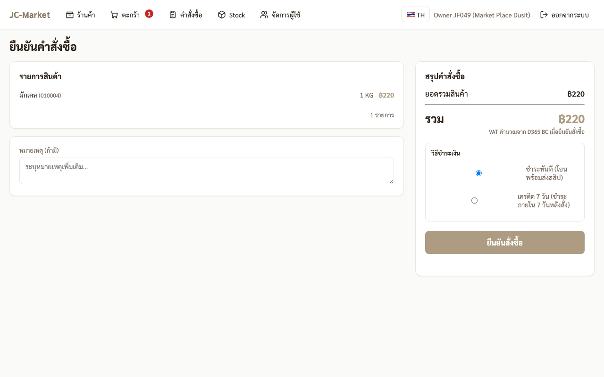

# 🏪 คู่มือสำหรับ FC (สาขาแฟรนไชส์ — JF)

ขั้นตอนตั้งแต่ login จนถึงรับของเข้าคลัง

---

## 1. Login เข้าระบบ

- URL: `http://<server>:3863`
- Username: รหัสสาขาตัวพิมพ์เล็ก เช่น `jf049`
- Password: รหัสที่ HQ ส่งให้ (8 ตัว, รูปแบบ `AA######`)

## 2. หน้าร้านค้า

คลิกเมนู **ร้านค้า** ที่แถบบน · ด้านซ้ายเป็น sidebar 2 หมวด

- 📦 **สินค้าทั่วไป** — รวมของแห้ง, บรรจุภัณฑ์, ยูนิฟอร์ม ฯลฯ
- 🍎 **ผลไม้สด** — เฉพาะหมวดผลไม้

> **กฎสำคัญ**: สั่ง "สินค้าทั่วไป" กับ "ผลไม้สด" รวมตะกร้าเดียวกันไม่ได้ ต้องแยกออร์เดอร์

## 3. เลือกสินค้า

คลิกหมวดให้กางออก → ดูสินค้า → คลิก **+ สั่ง** เพื่อใส่ตะกร้า

ตะกร้าด้านบนจะมีตัวเลขสีแดงแสดงจำนวนรายการ

## 4. ตรวจตะกร้า

คลิก **ตะกร้า** บนเมนู — ดูรายการ ปรับจำนวน ลบรายการ

แถบเหลืองด้านบนของตะกร้าบอกหมวดที่ lock อยู่ (ป้องกันสั่งข้ามหมวด)

กด **ดำเนินการชำระเงิน** เพื่อไปขั้น checkout

## 5. ยืนยันคำสั่งซื้อ + เลือกวิธีชำระเงิน

**สำหรับ "ผลไม้สด"** มี 2 ทางเลือก:
- ⦿ **ชำระทันที** — โอนพร้อมส่งสลิป (default)
- ⦾ **เครดิต 7 วัน** — รับของก่อน ค่อยจ่ายภายใน 7 วัน (FC ที่มีหนี้ค้างเกินกำหนด จะสั่งผลไม้ใหม่ไม่ได้จนกว่าจะชำระครบ)

**สำหรับ "สินค้าทั่วไป"**: ชำระทันทีอย่างเดียว

กด **ยืนยันสั่งซื้อ**

## 6. ชำระเงิน + ส่งสลิป (กรณีชำระทันที)

ระบบจะแสดง QR PromptPay + ปุ่มอัปสลิป (countdown 30 นาที สำหรับ general, 7 วันสำหรับเครดิต)

- สแกน QR ด้วยแอปธนาคาร → โอนเงิน
- บันทึก slip
- คลิกพื้นที่ "อัปโหลดสลิป" → เลือกไฟล์ → กด **ส่งสลิป**

หลังส่งสลิปจะขึ้น "⏳ ส่งสลิปแล้ว — รอ Finance ตรวจสอบ"

## 7. รอ Finance ตรวจสอบ

- Finance จะ approve ภายใน 1 ชม. ในเวลาทำงาน
- ถ้า **อนุมัติ** → คำสั่งซื้อกลายเป็น "✅ อนุมัติแล้ว" + ระบบสร้าง BC SO + PO อัตโนมัติ
- ถ้า **ปฏิเสธ** → ออร์เดอร์เปลี่ยนเป็น "❌ สลิปถูกปฏิเสธ" + แสดงเหตุผล
  - กดปุ่ม "🔁 อัปโหลดสลิปใหม่" บนหน้าคำสั่งซื้อเพื่อส่งสลิปใหม่

## 8. รับของเข้าคลัง

เมื่อสินค้ามาถึงสาขา:
- เปิดเมนู **คำสั่งซื้อ** → คลิกออร์เดอร์ที่ "รออัปเดต/จัดส่งแล้ว"
- คลิก **ยืนยันรับของ** → กรอกจำนวนจริงที่ได้รับ → confirm
- ระบบบันทึก Goods Receipt + อัปเดต Stock สาขา

## 9. เคล็ดลับ

- หา **Stock สาขา** ดูสินค้าคงเหลือ + ประวัติการรับ/เบิก
- ใบเสร็จ PDF ดูได้จากออร์เดอร์ที่อนุมัติแล้ว → "🧾 ใบเสร็จรับเงิน"
- เปลี่ยนภาษา TH/EN ที่มุมขวาบน
