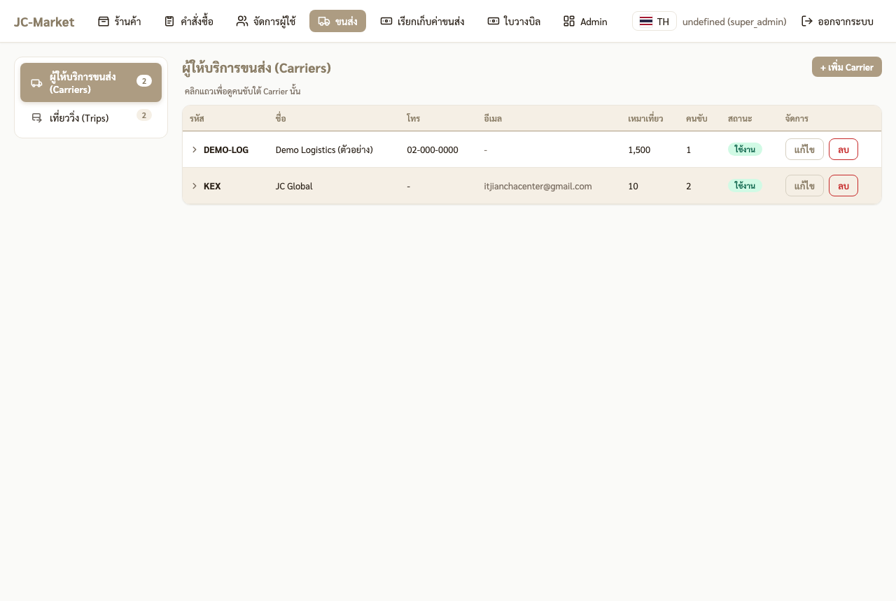
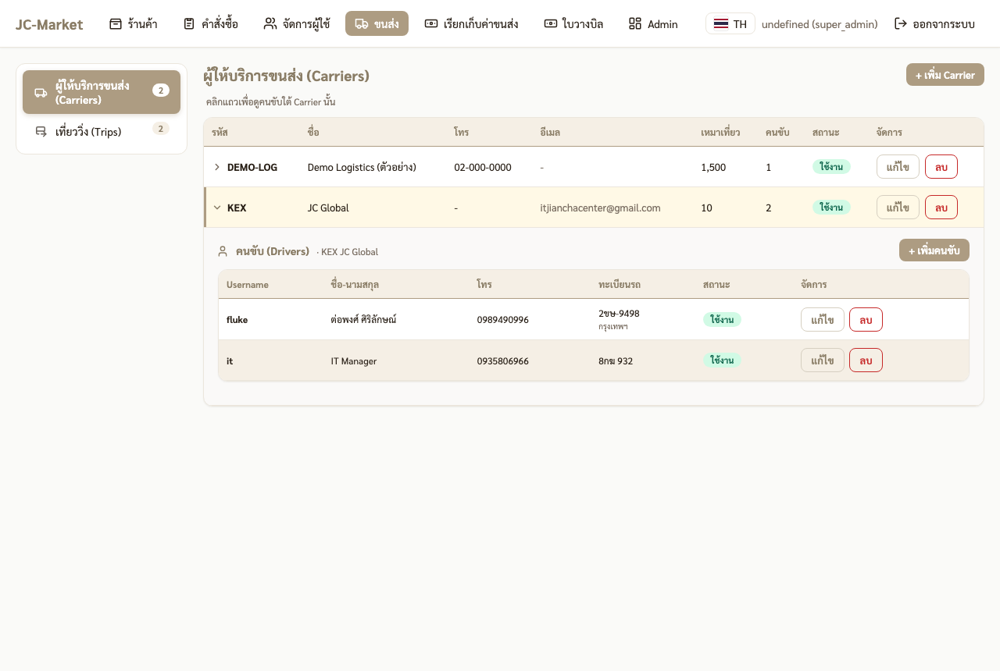
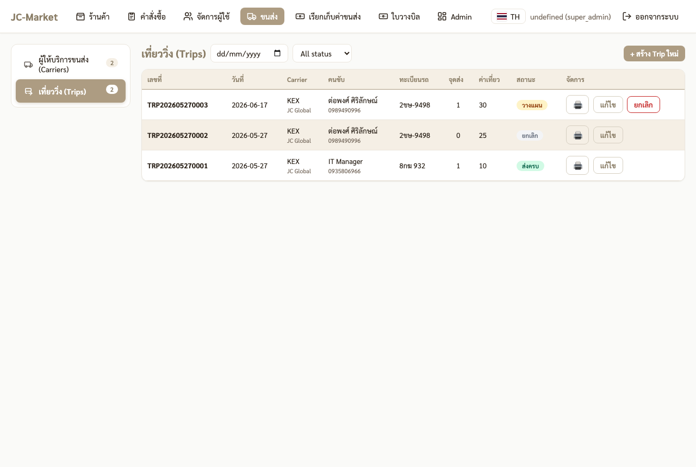
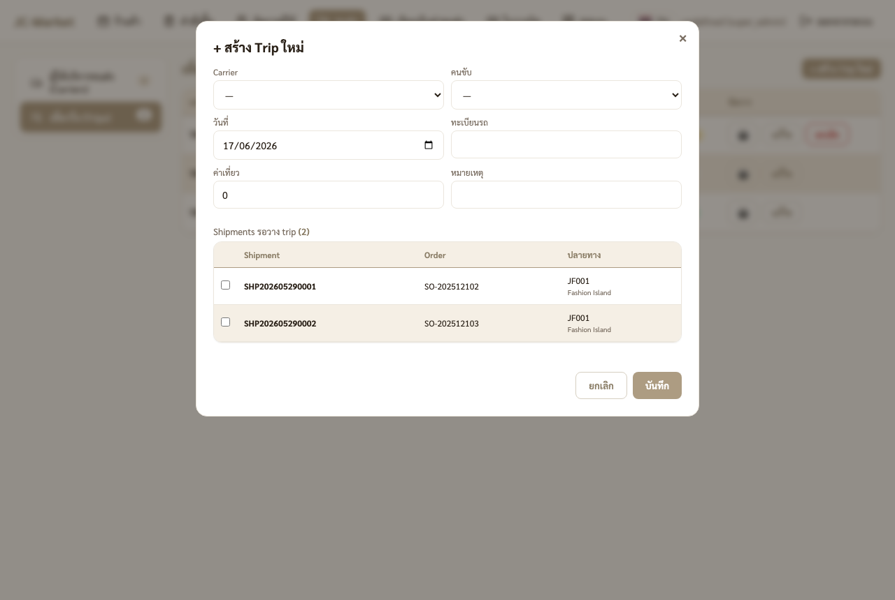
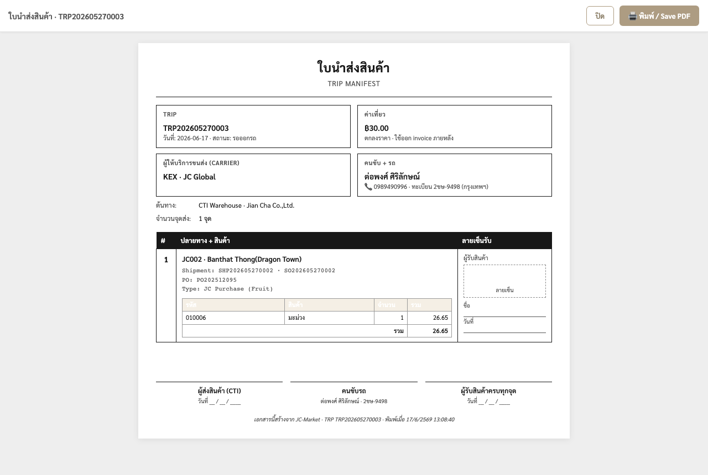

# 🏭 คู่มือ TMS — ส่วนคลัง CTI (ผู้จัดเที่ยวรถ)

จัดของจากคลัง CTI ขึ้นรถส่งสาขา — จัดการขนส่ง/คนขับ, รวม shipment เป็นเที่ยว (Trip), พิมพ์ใบนำส่ง

> ระบบ TMS อยู่ในเมนู **ขนส่ง** ใช้ได้เฉพาะบทบาท HQ (`super_admin` / `admin_scm`)

---

## ภาพรวม flow

```
สาขาสั่งของ → ระบบเปิดเอกสาร BC สำเร็จ → สร้าง "shipment" อัตโนมัติ (ต้นทาง = CTI)
   → shipment เข้า pool (รอวางเที่ยว)
   → คลัง CTI สร้าง Trip + เลือก shipment + จับคู่ขนส่ง/คนขับ
   → พิมพ์ใบนำส่ง → คนขับออกรถ → ส่ง + ถ่าย POD → ปิดงาน
```

shipment ถูกสร้างให้อัตโนมัติ — **คลัง CTI ไม่ต้องสร้างเอง** หน้าที่คือ "จับของขึ้นเที่ยว" และส่งคนขับ

## 1. เข้าหน้า TMS

- URL: `http://<server>:3863` → login ด้วยบัญชี IT/Admin
- กดเมนู **ขนส่ง** ด้านบน

## 2. ผู้ให้บริการขนส่ง (Carriers)



ทะเบียนบริษัทขนส่งที่ใช้งาน — แต่ละแถวมี:
- **รหัส / ชื่อ** (เช่น KEX · JC Global)
- **โทร / อีเมล** ติดต่อ
- **ราคาเหมาเที่ยวเริ่มต้น** (ใช้เป็นค่าตั้งต้นตอนสร้าง Trip)

กด **+ เพิ่ม Carrier** เพื่อเพิ่มขนส่งใหม่ · คลิกแถวเพื่อกางดูคนขับใต้รายนั้น

## 3. คนขับใต้ Carrier



คลิกแถว Carrier → กางรายการ **คนขับ (Drivers)** ของขนส่งรายนั้น แสดง **username · ชื่อ-นามสกุล · เบอร์โทร**

> 📱 เบอร์โทรนี้คือสิ่งที่คนขับใช้ **login เข้าแอปคนขับ** (ไม่มีรหัสผ่าน) — ต้องเพิ่มคนขับที่นี่ก่อน คนขับถึงจะเข้าแอปได้

กด **+ เพิ่มคนขับ** ใต้ Carrier เพื่อลงทะเบียนคนขับ (ชื่อ, เบอร์, ทะเบียนรถ, จังหวัด)

## 4. เที่ยววิ่ง (Trips)



แท็บ **เที่ยววิ่ง** แสดงทุกเที่ยว — **เลขที่ · วันที่ · Carrier · คนขับ · จำนวนจุดส่ง · สถานะ**

สถานะเที่ยว: `planned` (วางแผน) → `dispatched` (ออกรถแล้ว) → `completed` (ส่งครบ) / `cancelled`

ปุ่มในแต่ละแถว: **🖨️ พิมพ์ใบนำส่ง** · **แก้ไข** (เพิ่ม/ถอด stop ได้ตอนยัง planned)

## 5. สร้าง Trip ใหม่ (ขั้นตอนหลัก)

กด **+ สร้าง Trip ใหม่**



กรอกหัวเที่ยว แล้วเลือก shipment เข้าเที่ยว:

| ช่อง | ใส่ |
|---|---|
| **Carrier** | เลือกบริษัทขนส่ง |
| **คนขับ** | เลือกคนขับของ Carrier นั้น |
| **วันที่** | วันที่ออกรถ |
| **ทะเบียนรถ** | ทะเบียนรถเที่ยวนี้ (เว้นว่าง = ใช้รถประจำคนขับ) |
| **ค่าเที่ยว** | ราคาที่ตกลงกับขนส่ง (เด้งค่าตั้งต้นจาก Carrier) |
| **Shipments รอวาง trip** | ✅ ติ๊กเลือก shipment ที่จะส่งเที่ยวนี้ |

> กล่อง **"Shipments รอวาง trip (N)"** = pool ของ shipment ที่ยังไม่ได้วางเที่ยว (ต้นทาง CTI ทุกรายการ) เห็นเลข Order + ปลายทางสาขา — ติ๊กให้ครบจุดที่จะวิ่งเที่ยวนี้

กด **บันทึก** → shipment ที่เลือกเปลี่ยนเป็น `planned` และผูกกับเที่ยวนี้ (ลำดับ stop เรียงตามที่เลือก)

## 6. พิมพ์ใบนำส่งสินค้า (Manifest)

กด **🖨️** บนแถวเที่ยว → เปิดใบนำส่งสำหรับพิมพ์/Save PDF แนบไปกับรถ



ใบนำส่งมี: ข้อมูลเที่ยว/ขนส่ง/คนขับ-รถ, ต้นทาง CTI, **ทุกจุดส่ง + รายการสินค้าต่อจุด**, และ**ช่องลายเซ็นผู้รับ**ต่อจุด + ช่องเซ็นผู้ส่ง/คนขับ/ผู้รับครบทุกจุดด้านล่าง

> ใช้เป็นเอกสารคุมของขึ้นรถ + ให้สาขาเซ็นรับ (สำรองกรณีคนขับถ่าย POD ในแอปไม่ได้)

## 7. ข้อควรรู้

- **shipment สร้างอัตโนมัติ** ตอนเอกสาร BC ของออร์เดอร์สำเร็จ — FC ผูกกับ BC Sales Order, JC ทั่วไปผูก Transfer Order, JC ผลไม้ผูก Purchase Order
- **ต้นทางทุก shipment = CTI** (คลังกลาง)
- **JC008 / JC009 / JC010** ยังไม่มี location ใน BC — ออเดอร์อาจไม่เกิด shipment จนกว่าจะตั้งค่า
- เพิ่ม/ถอด stop ได้เฉพาะตอนเที่ยวยัง **planned** — พอคนขับกดออกรถ (dispatched) จะล็อก
- ลำดับ stop (`stop_seq`) ตอนนี้เรียงตามลำดับที่ติ๊กเลือก — ยังไม่มี auto จัดเส้นทาง
- หลังคนขับส่งครบทุกจุด เที่ยวจะเป็น **completed** อัตโนมัติ

---

> คู่มือฝั่งคนขับ: [🚚 ส่วนขนส่ง (คนขับ)](./tms-transport.md)
