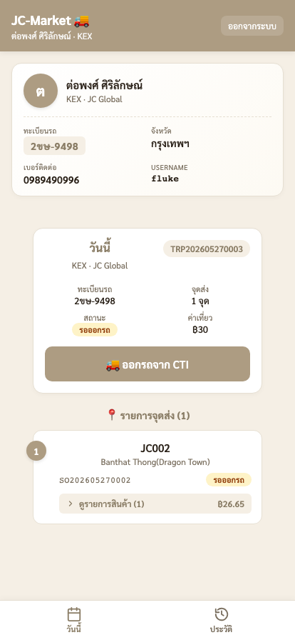
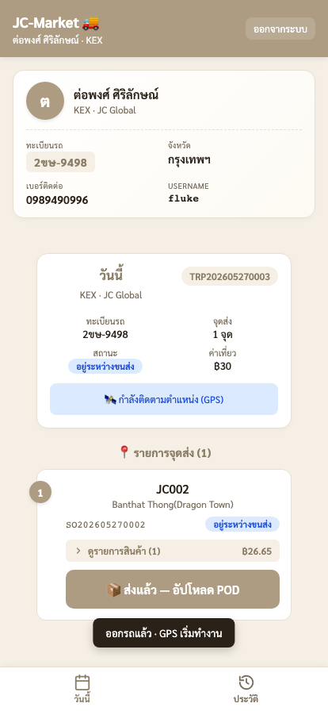
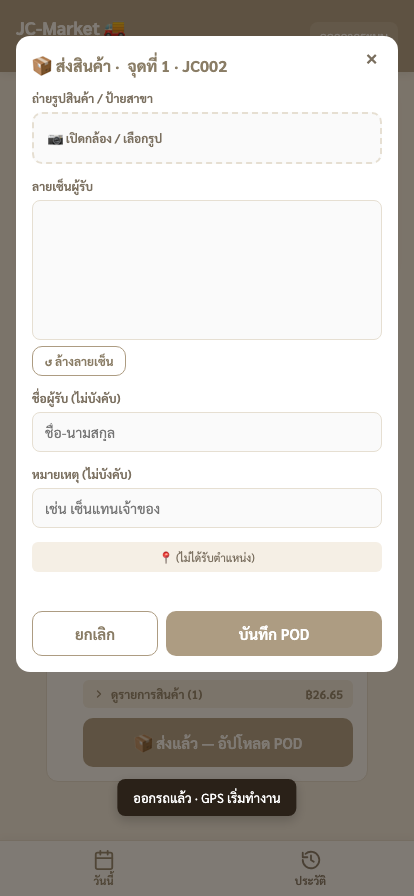

# 🚚 คู่มือ TMS — ส่วนขนส่ง (คนขับ)

แอปคนขับบนมือถือ — ดูเที่ยววันนี้, ออกรถจาก CTI, ส่งของ + ถ่ายหลักฐานการส่ง (POD)

> เปิดบนมือถือ: `http://<server>:3863/driver.html` (แนะนำ "เพิ่มลงหน้าจอโฮม" ใช้เหมือนแอป)

---

## 1. เข้าระบบด้วยเบอร์โทร

- ใส่ **เบอร์โทรของคุณ** → กด **เข้าสู่ระบบ**
- ไม่ต้องใช้รหัสผ่าน — ระบบจำคุณจากเบอร์ที่คลัง CTI ลงทะเบียนไว้

> ❗ ถ้าขึ้น "ไม่พบเบอร์นี้ในระบบ" = คลัง CTI ยังไม่ได้เพิ่มคุณเป็นคนขับ ให้แจ้ง IT/คลัง เพิ่มเบอร์ให้ก่อน

## 2. หน้าวันนี้ (เที่ยวของคุณ)

หน้าแรกหลัง login แสดง:
- **การ์ดโปรไฟล์** — ชื่อ, ขนส่ง, ทะเบียนรถ, จังหวัด, เบอร์, username
- **การ์ดเที่ยววันนี้** — เลขเที่ยว, ทะเบียนรถ, **จำนวนจุดส่ง**, สถานะ (`รอออกรถ`), ค่าเที่ยว
- **📍 รายการจุดส่ง** — แต่ละจุด: สาขา, ที่อยู่, เลขออร์เดอร์, กด **ดูรายการสินค้า** เพื่อเช็กของก่อนขึ้นรถ

> แท็บล่าง: **วันนี้** / **ประวัติ** (ดูเที่ยวที่ส่งไปแล้ว)

## 3. ออกรถจาก CTI

ตรวจของขึ้นรถครบแล้ว → กดปุ่ม **🚚 ออกรถจาก CTI** → ยืนยัน

หลังกดออกรถ:
- สถานะเที่ยวเปลี่ยนเป็น **อยู่ระหว่างขนส่ง**
- ระบบ **เริ่มติดตามตำแหน่ง GPS** อัตโนมัติ (📡) — คลังเห็นว่ารถอยู่ไหน
- แต่ละจุดส่งจะมีปุ่ม **📦 ส่งแล้ว — อัปโหลด POD** โผล่ขึ้นมา

> ครั้งแรกมือถือจะขอสิทธิ์ **ตำแหน่ง (Location)** — กด **อนุญาต** เพื่อให้ GPS ทำงาน

## 4. ส่งของ + อัปโหลด POD

ถึงสาขาแล้ว ส่งของเสร็จ → กด **📦 ส่งแล้ว — อัปโหลด POD** ของจุดนั้น

กรอกหลักฐานการส่ง (Proof of Delivery):

| ช่อง | บังคับ? | รายละเอียด |
|---|---|---|
| **📷 ถ่ายรูปสินค้า / ป้ายสาขา** | ✅ บังคับ | เปิดกล้องถ่าย หรือเลือกรูป |
| **ลายเซ็นผู้รับ** | – | เซ็นบนจอ (กด "ล้างลายเซ็น" เพื่อเริ่มใหม่) |
| **ชื่อผู้รับ** | – | ชื่อคนเซ็นรับ |
| **หมายเหตุ** | – | เช่น "เซ็นแทนเจ้าของ" |
| **📍 ตำแหน่ง** | อัตโนมัติ | ระบบดึง GPS ตอนกดบันทึกให้เอง |

กด **บันทึก POD** → จุดนั้นเปลี่ยนเป็น **ส่งแล้ว**

> ส่งครบทุกจุด → เที่ยวปิดเป็น **completed** อัตโนมัติ

## 5. ประวัติ

แท็บ **ประวัติ** ด้านล่าง — ดูเที่ยวที่ส่งเสร็จย้อนหลัง พร้อม POD ของแต่ละจุด (รูป + ลายเซ็น + เวลา)

## 6. ข้อควรรู้

- **1 เบอร์ = 1 คนขับ** — เห็นเฉพาะเที่ยวของขนส่งตัวเอง ไม่เห็นของเจ้าอื่น
- **GPS ต้องเปิด** — ถ้าปฏิเสธสิทธิ์ตำแหน่ง การติดตามจะไม่ทำงาน (แต่ส่ง/ถ่าย POD ได้ปกติ)
- **ต้องถ่ายรูป POD อย่างน้อย 1 รูป** ถึงจะบันทึกได้ — ลายเซ็น/ชื่อ/หมายเหตุไม่บังคับ
- ใช้ได้บน **HTTPS หรือ localhost** เท่านั้น (กล้อง + GPS ของเบราว์เซอร์ต้องการ secure context)
- ถ้าออกรถผิดเที่ยว/กดพลาด แจ้งคลัง CTI แก้ให้ (คนขับถอยสถานะเองไม่ได้)

---

> คู่มือฝั่งคลัง: [🏭 ส่วนคลัง CTI (ผู้จัดเที่ยวรถ)](./tms-cti.md)
